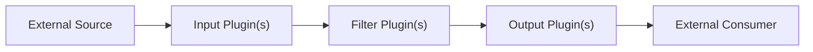

# bunstash
paStash in BUN development Repo

## How to run it

First clone this git repo into a folder
```
git clone https://github.com/sipcapture/bunstash.git
```

Navigate into the bunstash folder
```
cd bunstash
```

Install all dependencies
```bun install```

Then simply run it with the config_file parameter, specifying where the configuration file is located.
```bash
./bin/bunstash --config_file=/etc/bunstash/bunstash.cfg
```

## Current Progress

- [x] Start and parse config files
- [ ] Process Plugins
- [ ] Handle Inputs, Filters and Outputs
- [ ] Complete Documentation, including a 'make your own Plugin' guide

## Concepts

In bunstash, data is handled by either push or pull (depending on the plugin in use).

Either way the data flows from left to right as below:
